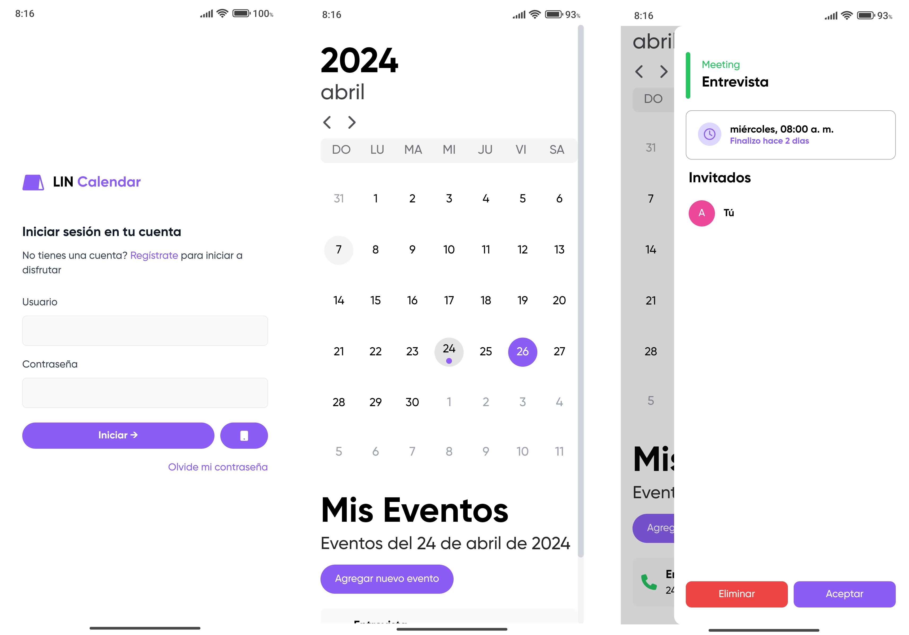
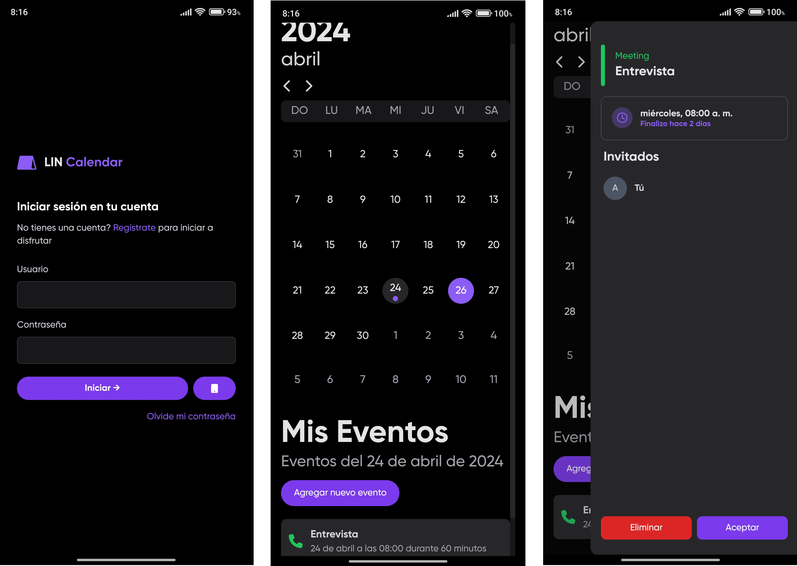

  

    
  

  
LIN Calendar es un proyecto de gestión de eventos, disponible para todos con el objetivo de ser confiable, seguro y multiplataforma.

  

    
    
  

## Características

- Gestionar eventos (Eventos, cumpleaños, aniversarios y reuniones)
- Passkey para iniciar con huella digital. (Usando LIN Vault) 
- Multiplataforma.
- Sincronización en la nube con LIN Account.

## Tecnologías

- .NET 8.
- MAUI & Blazor Hybrid App.
- HTML, CSS y JavaScript.
- Tailwind CSS.

## Home

#### Modo claro

#### Modo oscuro

# Soporte

Para soporte, correo giraldojhong4@gmail.com

